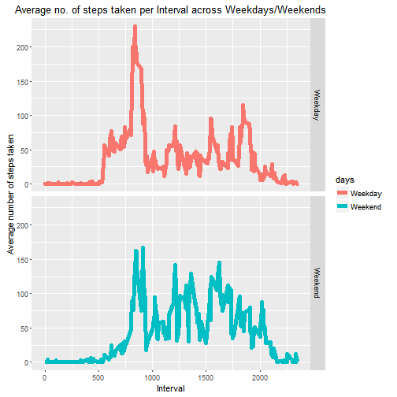

=================================================================================  
**Title   : "RR - Course Project 1"**  
**Author  : Sathya **  
**Date    : 30-July-2016**  
=================================================================================  
<center>
#Analysis of Activity Monitoring Data
</center>

##Introduction

This assignment aims at writing a report that answers a few questions. It needs an  analysis of the activity data obtained from a personal activity monitoring device. This device collects the number of steps taken by the individual throughout the day at 5 minutes interval.

##Purpose

The purpose of this assignment is: 

  1. to make us learn to generate RMarkdown document  
  2. to know the importance of reproducibility  
  3. to analyse the data and produce answers for the given questions  
  
##Dataset Description

The dataset is stored in a comma-separated-value (CSV) file and there are a total of 17,568 observations in this dataset.The variables in the activity monitoring data are:    

- *steps*: Number of steps taking in a 5-minute interval (missing values are coded as NA)  
- *date*: The date on which the measurement was taken in YYYY-MM-DD format  
- *interval*: Identifier for the 5-minute interval in which measurement was taken 

##Loading the data


```r
activity <- read.csv("activity.csv")
head(activity)
```

```
##   steps       date interval
## 1    NA 2012-10-01        0
## 2    NA 2012-10-01        5
## 3    NA 2012-10-01       10
## 4    NA 2012-10-01       15
## 5    NA 2012-10-01       20
## 6    NA 2012-10-01       25
```

##Mean Total number of steps taken per day:  

###calculation of total no. of. steps per day

```r
stepsop <- aggregate(steps~date,data=activity,FUN=sum,na.rm=TRUE)
```

###Histogram
Here is the histogram of the total number of steps taken per day:


```r
hist(stepsop$steps,col="cyan",xlab="Total number of steps taken per day",main="Histogram of total number of steps taken per day")
```


###Mean and median computation


```r
meansteps <- mean(stepsop$steps)
cat("Mean Value:", meansteps)
```

```
## Mean Value: 10766.19
```

```r
mediansteps <- median(stepsop$steps)
cat("Median Value:", mediansteps)
```

```
## Median Value: 10765
```

##Average daily activity pattern

###Time Series Plot
The below plot show the time series plot of the 5 minutes interval and the average number of steps taken(across all days).

```r
stepstp <- aggregate(steps~interval,data=activity,FUN=mean,na.rm=TRUE)
plot(stepstp$interval,stepstp$steps,type="l",lwd=3,col="green",xlab="interval",ylab="Average number of steps taken",main="Time series plot : Average no.of. steps Vs Interval")
```


###Maximum number of steps

The following code segment computes the interval in which the maximum number of steps occured:

```r
maxind <- which.max(stepstp$steps)
maxsteps <- stepstp[maxind,]
print(maxsteps)
```

```
##     interval    steps
## 104      835 206.1698
```

##Imputing Missing Values

###Count of the rows having NAs:


```r
nonmiss <- complete.cases(activity)
miss <- sum(!nonmiss) ##returns the count of missing rows
print(miss)
```

```
## [1] 2304
```

The total number of rows having NA's are: 2304

Now lets check exactly in which column the missing values occur.

```r
intervalcount <- is.na(activity$interval)
cat("No.of.missing rows in interval column:",sum(intervalcount))
```

```
## No.of.missing rows in interval column: 0
```

```r
datecount <- is.na(activity$date)
cat("No.of.missing rows in date column:",sum(datecount))
```

```
## No.of.missing rows in date column: 0
```

So from the above code, it is clear that there are missing values only in the steps column of the dataset. Only steps column has to be imputed with new values.

###creation of new dataset by filling the missing values:

A new dataset can be created by imputing the missing values in the steps column of the dataset with the average number of steps taken across all days.


```r
newactivity <- activity
missindex <- which(nonmiss ==FALSE) ##Get the index of the missing rows
##fill the missing values with the mean value of the no.of steps taken across each interval
newactivity$steps[missindex] <- stepstp$steps[match(newactivity$interval[missindex], stepstp$interval)]
head(newactivity)
```

```
##       steps       date interval
## 1 1.7169811 2012-10-01        0
## 2 0.3396226 2012-10-01        5
## 3 0.1320755 2012-10-01       10
## 4 0.1509434 2012-10-01       15
## 5 0.0754717 2012-10-01       20
## 6 2.0943396 2012-10-01       25
```

Let's check if there are any more missing values in the dataset.


```r
nonmiss <- complete.cases(newactivity)
newmiss <- sum(!nonmiss)
print(newmiss)
```

```
## [1] 0
```

###Histogram for the new dataset


```r
stepsnew <- aggregate(steps~date,data=newactivity,FUN=sum,na.rm=TRUE)
```

Here is the histogram of the total number of steps taken per day computed on the new dataset:


```r
hist(stepsnew$steps,col="green",xlab="Total number of steps taken per day",main="Histogram of total number of steps taken per day - imputed dataset")
```


###Mean and median computation


```r
meannew <- mean(stepsnew$steps)
cat("Mean Value:", meannew)
```

```
## Mean Value: 10766.19
```

```r
mediannew <- median(stepsnew$steps)
cat("Median Value:", mediannew)
```

```
## Median Value: 10766.19
```

So, we find that the mean for the old(with NA's) and new(imputed) dataset are same i.e 1.0766189 &times; 10<sup>4</sup>. The median for the old dataset was 10765 but the new dataset has a median of 1.0766189 &times; 10<sup>4</sup>. The process of imputing missing values has not affected the mean value. It has a very minor impact on the median value.

##Difference in activity pattern between weekdays and weekends

###weekday computation

We create a new dataset with a new factor variable indicating whether the given date is a weekday / weekend, Using the weekdays() function.


```r
day <- weekdays(as.Date(newactivity$date)) ##returns the day of the given date
weekday <- c("Monday","Tuesday","Wednesday","Thursday","Friday")
days <- ifelse(day %in% weekday, "Weekday", "Weekend")
##add a new column indicating whether the given date is a weekday / weekend
dayactivity <- cbind(newactivity,"days" = as.data.frame(as.factor(days))) 
names(dayactivity)[4] <- "days"
head(dayactivity)
```

```
##       steps       date interval    days
## 1 1.7169811 2012-10-01        0 Weekday
## 2 0.3396226 2012-10-01        5 Weekday
## 3 0.1320755 2012-10-01       10 Weekday
## 4 0.1509434 2012-10-01       15 Weekday
## 5 0.0754717 2012-10-01       20 Weekday
## 6 2.0943396 2012-10-01       25 Weekday
```


```r
library(ggplot2)
##aggregate on both interval and weekdays/weekends
stepsdays <- aggregate(dayactivity$steps,by=list(dayactivity$interval,dayactivity$days),FUN=mean,na.rm=TRUE)
colnames(stepsdays) <- c("interval", "days", "steps")
ggplot(stepsdays, aes(interval, steps, colour = days)) + geom_line(lwd=2) + facet_grid(days ~ .) +
    labs(x="Interval",y="Average number of steps taken", title="Average no. of steps taken per Interval across Weekdays/Weekends")
```



##Summary

Thus the report loads the given dataset, makes analysis and answers all the given questions in the assignment.


